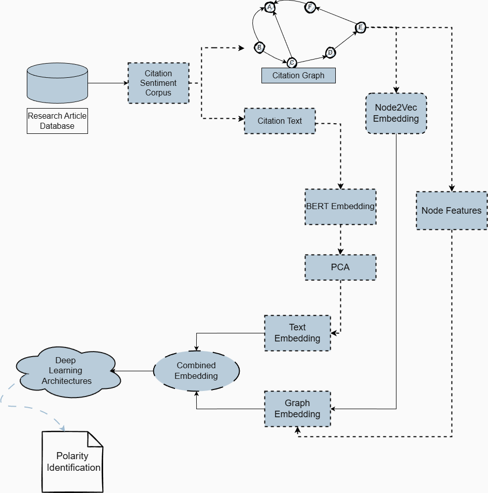
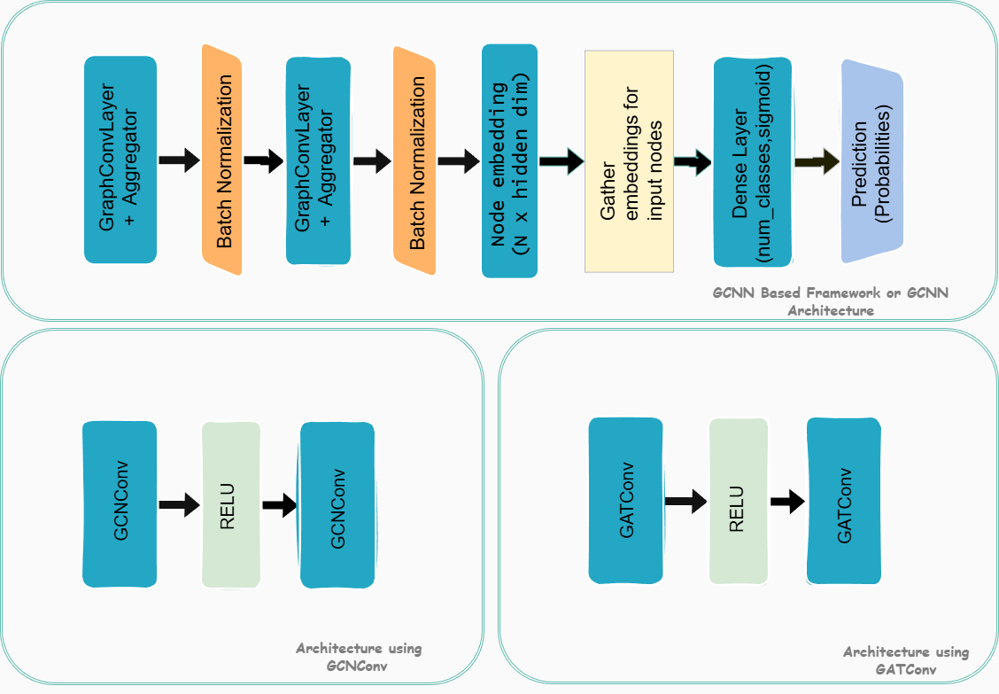

# Citation-Sentiment-Analysis

Code for the paper **_Hybrid Graph–Language Embedding Framework for Citation-Aware
Sentiment Analysis_** (Anukul Kapoor, Shreyansh Gupta, Akshay Deepak; NIT Patna).

## Overview

Citation counts measure how often a paper is cited but not how it is cited —
whether the reference is positive, neutral, or negative. This repository performs
citation sentiment analysis: given a sentence in which one paper cites another,
the sentiment is classified as **positive**, **neutral (objective)**, or
**negative**.

The method represents each citation from two perspectives:

- **Text** — the citation sentence, encoded with BERT.
- **Structure** — the paper's position in the citation graph, encoded with
  Node2Vec.

The two representations are concatenated and passed through a graph neural network
(a Keras GCNN, and separately PyTorch Geometric `GCNConv` / `GATConv`), followed by
a classifier that predicts the sentiment. Combining structural and textual
information improves accuracy over text-only baselines.

## Framework



*Figure 1. The pipeline from the annotated corpus to a predicted polarity.*

1. The corpus provides, for each citation: source paper id, target paper id,
   sentiment label, and the citation sentence.
2. Two streams are derived from the corpus:
   - The citation graph (source → target) is used to compute Node2Vec embeddings
     and, for the PyG models, node centrality features.
   - The citation sentence is encoded with BERT and reduced to a compact text
     embedding with PCA.
3. The graph and text embeddings are concatenated into a single node vector.
4. A graph neural network updates each node using its neighbours.
5. A classifier predicts positive, neutral, or negative.

## Models



*Figure 2. The two graph neural network designs.*

**GCNN framework (top).** Two `GraphConvLayer + Aggregator` blocks, each followed
by batch normalization, produce node embeddings of shape `N × hidden_dim`. The
embeddings of the target nodes are gathered and passed through a dense layer with
sigmoid activation. The GCNN output is then used as input to a classical
classifier (Random Forest, SVM, and others) for the final prediction.

**PyG `GCNConv` / `GATConv` (bottom).** A two-layer `GCNConv → ReLU → GCNConv`
model, or the attention-based `GATConv` variant with multi-head attention. These
models also use six structural centrality features in addition to the fused
embedding, giving a 262-dimensional node vector.

## Method summary

| Stage | Description |
|---|---|
| **Graph** | Directed citation graph (source → target); nodes with out-degree 0 are removed, giving **2,992 nodes and 1,589 edges**. |
| **Node2Vec** | 128-dimensional structural embedding per paper. |
| **BERT** | `bert-base-uncased` `[CLS]` vector (768-d), reduced to 128-d with PCA. |
| **Fusion** | Node2Vec + BERT → 256-d (the PyG models add 6 centralities → 262-d). |
| **GNN** | Two-layer Keras GCNN, or PyG `GCNConv` / `GATConv`. |
| **Classifier** | LR, DT, RF, SVM, AdaBoost, SGD, ExtraTrees, Voting. |

Labels are encoded as `negative → 0`, `objective → 1`, `positive → 2`.

## Two evaluation settings

- **Classical baselines (Tables 2–4):** embeddings are passed directly to a
  classifier, without a GNN.
- **Proposed GCNN / PyG (Table 1):** embeddings are processed by a GNN before
  classification.

## Repository layout

```
.
├── data/                 # dataset goes here (not committed) — see data/README.md
├── image/                # figures used in this README
├── notebook/             # the original Colab notebooks
├── run_all.sh            # run every experiment with one command
├── requirements.txt
└── src/
    ├── config.py         # all hyperparameters and CLI flags
    ├── common.py         # seeding, data loading, graph construction, splits
    ├── graph_features.py # directed node/edge features and scaling
    ├── embeddings.py     # Node2Vec + BERT (with on-disk cache) and feature assembly
    ├── precompute_embeddings.py   # build and cache the embeddings once
    ├── tf_gnn.py         # the Keras GCNN (GraphSAGE-style aggregators)
    ├── pyg_models.py     # PyG GCN / GAT / APPNP and the training loop
    ├── classifiers.py    # the downstream classical classifiers
    ├── metrics.py        # macro / micro / weighted reporting
    ├── pipeline.py       # the classical, GCNN, and PyG pipelines
    ├── run_node2vec.py / run_bert.py / run_hybrid.py            # GCNN  (Table 1)
    ├── run_baseline_node2vec.py / run_baseline_bert.py / run_baseline_hybrid.py  # classical (Tables 2-4)
    └── run_pyg.py        # PyG GCNConv / GATConv (Table 1)
```

Each `src/run_*.py` corresponds to one of the original `notebook/*.ipynb` files.

## Installation

Recommended: **Python 3.10 or 3.11** (matches the original environment, where all
dependencies are compatible with `numpy < 2`):

```bash
python -m venv .venv
.venv\Scripts\activate          # Windows  (source .venv/bin/activate on Linux/Mac)
pip install -r requirements.txt
```

On **Python 3.13**, TensorFlow requires `numpy >= 2` while `gensim` (used only to
build the Node2Vec embeddings) requires `numpy < 2`, so they cannot be installed
together. In that case, install in two phases: first `pip install node2vec
transformers torch` and run the embedding precompute; then `pip uninstall -y
gensim node2vec`, `pip install "numpy>=2" tensorflow torch-geometric`, and run the
training from the cache. The code was verified on CPU.

## Dataset

The experiments use the **ACL Citation Sentiment Corpus** (Athar, 2011): 8,736
annotated citation instances, each with four fields — source paper id, target
paper id, sentiment, and the citation sentence.

The corpus is not committed. Place a copy at:

```
data/citation_sentiment_corpus.txt
```

Format and source details are given in [`data/README.md`](data/README.md). The
path can be changed with `--data-path`.

## Running the experiments

**Step 1 (once): cache the embeddings.** Node2Vec is fast; BERT takes about
40 minutes on CPU. Subsequent runs load from `cache/`.

```bash
python src/precompute_embeddings.py --what all
```

**Step 2: run everything with one command:**

```bash
bash run_all.sh
```

Or run the experiments individually:

```bash
# Classical baselines (Tables 2-4): embeddings -> classifier
python src/run_baseline_node2vec.py
python src/run_baseline_bert.py
python src/run_baseline_hybrid.py

# Proposed GCNN -> ML (Table 1)
python src/run_node2vec.py
python src/run_bert.py
python src/run_hybrid.py

# PyG GCNConv / GATConv (Table 1)
python src/run_pyg.py --model gcn
python src/run_pyg.py --model gat
```

Each script prints accuracy and weighted precision, recall, and F1.

Flags available to every script: `--data-path`, `--seed`,
`--device auto|cuda|cpu`, `--no-cache`. The GCNN scripts also accept `--no-seed`,
`--runs N`, `--gridsearch`, `--epochs N`, and `--split-seed` / `--init-seed` (see
Reproducibility). `run_pyg.py` accepts `--model {gcn,gat,gcn_aug,appnp,gcn_edge}`,
`--features {node2vec,bert,fused}`, and `--no-structural`.

## Results (from the paper)

The tables below are the results reported in the paper. See
[Reproducibility](#reproducibility) for notes on re-running the GCNN.

**Table 1 — Proposed framework, baselines, and state of the art**

| Method | Accuracy | Precision | Recall | F1 |
|---|---|---|---|---|
| K. Alnowaiser (2024), TF-IDF w/o SMOTE (SVC) | 89.61% | 0.87 | 0.89 | 0.87 |
| M. Karim et al. (2022), TF-IDF w/o SMOTE | 88.28% | 0.86 | 0.88 | 0.86 |
| K. Alnowaiser (2024), TF-IDF w/o SMOTE (ETC) | 87.75% | 0.85 | 0.88 | 0.84 |
| Proposed GCNN(GCN→ML(RF)) — BERT | 87.55% | 0.79 | 0.87 | 0.82 |
| **Proposed GCNN(GCN→ML(RF)) — Node2Vec** | **90.56%** | 0.85 | 0.91 | 0.86 |
| Proposed GCNN(GCN→ML(RF)) — Node2Vec+BERT | 89.17% | 0.88 | 0.89 | 0.85 |
| Proposed GATConv — Node2Vec+BERT | 89.17% | 0.80 | 0.89 | 0.84 |
| Proposed GCNConv — BERT+Node2Vec | 89.72% | 0.89 | 0.90 | 0.87 |

**Table 2 — Classical ML on Node2Vec embeddings**

| Model | Accuracy | Precision | Recall | F1 |
|---|---|---|---|---|
| LR | 87.78% | 0.77 | 0.87 | 0.82 |
| DT | 86.11% | 0.76 | 0.86 | 0.81 |
| RF | 87.78% | 0.77 | 0.88 | 0.82 |
| AdaBoost | 88.08% | 0.87 | 0.88 | 0.83 |
| SVM | 87.78% | 0.77 | 0.88 | 0.82 |
| SGD | 87.78% | 0.77 | 0.88 | 0.82 |
| ETC | 87.78% | 0.76 | 0.88 | 0.82 |
| VC | 87.78% | 0.77 | 0.88 | 0.82 |

**Table 3 — Classical ML on BERT embeddings**

| Model | Accuracy | Precision | Recall | F1 |
|---|---|---|---|---|
| LR | 87.50% | 0.88 | 0.87 | 0.83 |
| DT | 86.94% | 0.81 | 0.87 | 0.83 |
| RF | 88.33% | 0.87 | 0.88 | 0.83 |
| AdaBoost | 87.78% | 0.77 | 0.87 | 0.82 |
| SVM | 87.78% | 0.77 | 0.87 | 0.82 |
| SGD | 86.39% | 0.79 | 0.86 | 0.82 |
| ETC | 88.33% | 0.87 | 0.88 | 0.83 |
| VC | 87.50% | 0.87 | 0.87 | 0.83 |

**Table 4 — Classical ML on Node2Vec + BERT embeddings**

| Model | Accuracy | Precision | Recall | F1 |
|---|---|---|---|---|
| LR | 86.94% | 0.82 | 0.87 | 0.83 |
| DT | 87.22% | 0.77 | 0.87 | 0.81 |
| RF | 87.78% | 0.77 | 0.87 | 0.82 |
| AdaBoost | 87.22% | 0.77 | 0.87 | 0.81 |
| SVM | 87.78% | 0.77 | 0.87 | 0.82 |
| SGD | 86.67% | 0.79 | 0.86 | 0.81 |
| ETC | 87.76% | 0.77 | 0.87 | 0.82 |
| VC | 86.94% | 0.81 | 0.86 | 0.83 |

LR = Logistic Regression, DT = Decision Tree, RF = Random Forest,
ETC = Extra Trees, VC = Voting Classifier.

## Reproducibility

The classical baselines (Tables 2–4) and the PyG `GCNConv` / `GATConv` models use
a fixed seed (`random_state=42`) and reproduce their reported numbers exactly. The
GCNN was originally trained without a fixed seed; the same setup is run with
`--no-seed`, and the two seeded runs below reproduce the reported accuracy.

```bash
python src/run_node2vec.py --no-seed --runs 20                              # original setup (no seed)
python src/run_node2vec.py --split-seed 179776560 --init-seed 1366669488   # 91.39%
python src/run_node2vec.py --split-seed 941508052 --init-seed 769732007    # 90.83%
```

## Citation

_Citation details to be added._

## Acknowledgements

We thank Claude (Anthropic) for helping us refactor our research notebooks into
the modular code in `src/` and write this documentation.
